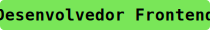
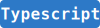
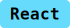
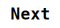

# 🧑🏻‍💻 João Reis

Olá 👋🏻, me chamo João Manoel Reis, tenho 22 anos e estudo Sistemas de Informação no Instituto Federal do Maranhão (IFMA). Atualmente sou Desenvolvedor Frontend, explorando tecnologias como **React**, **TypeScript** e **Tailwind CSS**. Meu objetivo é continuar aprendendo novas tecnologias e evoluir para me tornar um Desenvolvedor Fullstack.

---

### 🤖 Linguagens e Tecnologias

 &nbsp;  &nbsp;  &nbsp;  &nbsp;  &nbsp;  &nbsp;  &nbsp;  &nbsp; 

---

### 💼 Contato

Visite meu portfólio ou mande uma mensagem! 📫

 &nbsp; 

